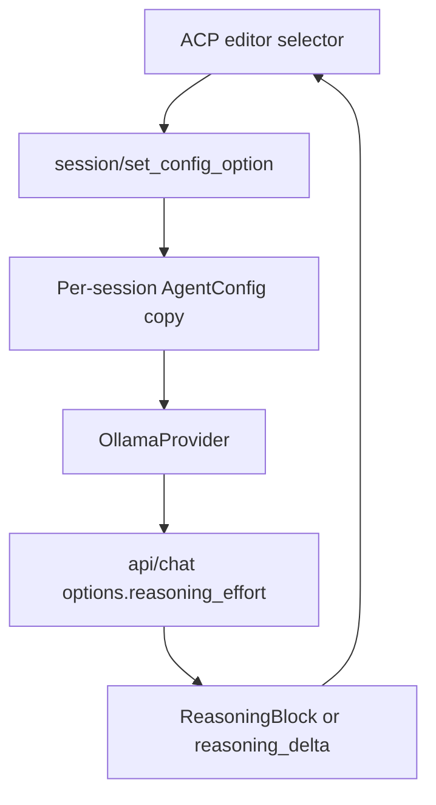

# Architecture

Aar is a lean, provider-agnostic agent framework. This document explains how the pieces fit together.

## Principles

1. **Thin core loop** — the main execution path (`loop.py`) is a single coroutine focused on control flow only. Helpers for provider requests, retries, event emission, and budget accounting live in sibling modules (`provider_runner.py`, `loop_helpers.py`). The loop does exactly three things: call the provider, execute tool calls, and append events to the session.
2. **Typed event model** — every interaction (messages, tool calls, results, metadata) is a Pydantic model. Events are serializable, inspectable, and carry timing data.
3. **Provider-agnostic** — the agent loop works with any provider that implements the `Provider` ABC. Swapping between Anthropic, OpenAI, Ollama, Gemini, or a generic endpoint requires changing one config field.
4. **Safe by default** — path restrictions, a best-effort command deny-list, and approval gates are built in and always active. Interactive modes enable a workspace sandbox by default.
5. **Modular transports** — the same `Agent` class runs from CLI, TUI, web API, or embedded in your code. Transports only handle I/O; they never contain business logic.

## Component overview

```
agent/
├── core/                     # The heart
│   ├── agent.py              # Agent class — orchestrator
│   ├── loop.py               # run_loop() — control flow only
│   ├── provider_runner.py    # request + retry + streaming
│   ├── loop_helpers.py       # event emit, budget accounting, parse_stop
│   ├── guardrails.py         # LoopGuardrails, GuardrailsConfig
│   ├── events.py             # Pydantic event models
│   ├── session.py            # event history + to_messages()
│   ├── config.py             # AgentConfig schema
│   ├── state.py              # AgentState enum
│   ├── tokens.py             # token budget + cost tracking
│   ├── multimodal.py         # multimodal content helpers
│   └── logging.py            # structured audit logging
│
├── providers/                # LLM API adapters
│   ├── base.py               # Provider ABC + ProviderResponse
│   ├── anthropic.py          # tools, streaming, extended thinking
│   ├── openai.py             # tools, streaming, Azure / Together via base_url
│   ├── ollama.py             # tools, thinking extraction, Qwen3.8 reasoning effort
│   ├── gemini.py             # tools, streaming, thinking; SDK + HTTP modes
│   └── generic.py            # any OpenAI-compatible endpoint
│
├── tools/                    # Tool registry and execution
│   ├── registry.py           # ToolRegistry, ToolSpec
│   ├── execution.py          # ToolExecutor → policy → sandbox
│   ├── schema.py             # JSON schema helpers
│   └── builtin/
│       ├── filesystem.py     # read_file, write_file, edit_file, list_directory
│       └── shell.py          # bash
│
├── safety/                   # Policy engine, permissions, sandboxes
│   ├── policy.py             # SafetyPolicy  ALLOW / DENY / ASK
│   ├── permissions.py        # ApprovalCallback, APPROVED_ALWAYS cache
│   ├── sandbox.py            # Local / Linux / Windows / WSL sandboxes
│   └── wsl_manager.py        # WSL2 distro lifecycle management
│
├── memory/
│   └── session_store.py      # JSONL event persistence + compaction
│
├── extensions/
│   ├── api.py                # ExtensionAPI, BlockResult, ExtensionContext, Protocols
│   ├── loader.py             # Three-tier auto-discovery + module loading
│   ├── manager.py            # ExtensionManager — wires extensions into the core loop
│   ├── mcp.py                # MCP bridge (stdio + HTTP transports)
│   ├── observability.py      # session_metrics() — reads event history only
│   └── contrib/              # Built-in example extensions
│       └── companion.py      # Living companion (mood, level, XP) as extension
│
└── transports/               # Thin I/O adapters — no business logic
    ├── cli.py                # Typer CLI (chat, run, tui, serve, acp)
    ├── tui.py                # Rich inline TUI
    ├── tui_fixed.py          # Textual full-screen TUI
    ├── web.py                # ASGI web server + SSE streaming
    ├── stream.py             # EventStream — cross-request pub/sub
    ├── keybinds.py           # keyboard shortcuts for fixed TUI
    ├── prompt_queue.py       # transport-agnostic prompt queue
    ├── acp_permissions.py    # ACP approval callback
    ├── acp/                  # ACP transport package
    │   ├── common.py         # shared helpers + ACP session config options
    │   ├── http.py           # HTTP / SSE server (REST clients)
    │   └── stdio.py          # SDK stdio transport (Zed)
    ├── themes/
    │   ├── models.py         # ThemeModel, ColorScheme
    │   └── builtin.py        # built-in themes
    ├── tui_utils/
    │   └── formatting.py     # shared Rich formatting helpers
    └── tui_widgets/          # Textual widget classes
        ├── bars.py
        ├── blocks.py
        ├── chat_body.py
        ├── input.py
        ├── log_viewer.py
        └── thinking_panel.py
```

## Core loop

The agent loop lives in `agent/core/loop.py`. It runs until the provider signals completion, a step limit is reached, a timeout fires, or cancellation is requested. `timeout=0.0` (the default) disables the wall-clock check.

```
while not done and step < max_steps:
    if cancel_event.is_set(): break
    if timeout > 0.0 and elapsed > timeout: break

    # streaming path (streaming: true)
    async for delta in provider.stream(messages, tools, system):
        emit(StreamChunk)       # text delta or reasoning delta
        # final delta carries usage counts
    emit(ProviderMeta)          # timing + token usage (after stream closes)

    # — or non-streaming path (streaming: false, the default) —
    response = await provider.complete(messages, tools, system)
    emit(ProviderMeta)          # timing + token usage

    for tool_call in response.tool_calls:
        emit(ToolCall)          # before execution
        result = await executor.execute_one(tool_call)
        emit(ToolResult)        # after execution

    if response.text:
        emit(AssistantMessage)  # after all tool calls in this step

    if response.stop_reason == "max_tokens" and recovery_budget_remaining:
        append_internal_continue_prompt()
        continue

    if response.stop_reason in {"end_turn", "max_tokens"}:
        done = True
```

**Event emission order matters:** `ToolCall` events are emitted *before* the `AssistantMessage` in the same step. This allows `session.to_messages()` to bundle `tool_use` blocks into the assistant message for the next provider call, matching the Anthropic/OpenAI message format.

**Token counts** arrive via the `ProviderMeta` event in both paths. For streaming responses, `_consume_stream()` in `agent/core/provider_runner.py` captures the usage data from the provider's final done-chunk and attaches it to the `ProviderResponse` before the event is emitted. This means the counts are always available on the same `ProviderMeta` event regardless of whether streaming is enabled. See [Tokens, costs, and budgets](tokens.md) for the full pipeline.

### Runtime guardrails

A small `LoopGuardrails` helper in `agent/core/guardrails.py` provides mechanical safety nets that cannot be expressed as prompt instructions:

- **Max-tokens recovery** — when the provider truncates output (`max_tokens`), the loop injects a continuation prompt instead of treating it as completion (up to a configurable limit)
- **Repetition circuit-breaker** — detects identical tool-call patterns repeating and stops the loop before burning budget in a spin
- **Budget proximity** — reports when remaining tokens or cost is within a reserve margin (used by transports for visual warnings)

These are purely mechanical — no behavioral scaffolding, no keyword heuristics, no dynamic system-prompt mutation. Agent behavior is guided entirely by the system prompt.

### Session and messages

`Session` (`agent/core/session.py`) holds the full event history. `session.to_messages()` converts the event stream into the provider-neutral message format:

- Pending `ToolCall` events are bundled as `tool_use` content blocks in the assistant message
- `ToolResult` events are flushed as `tool_result` content blocks in a user message
- This matches the Anthropic API's expected message structure (`assistant[text+tool_use] -> user[tool_result]`)

### State machine

```
IDLE → RUNNING → COMPLETED
                → CANCELLED
                → ERROR
                → MAX_STEPS
                → TIMED_OUT
                → BUDGET_EXCEEDED
       RUNNING → WAITING_FOR_TOOL → RUNNING
       RUNNING → WAITING_FOR_INPUT (interactive transports)
```

State transitions are managed by the loop. The final state is set on the session before returning.

## Providers

All providers implement the `Provider` ABC (`agent/providers/base.py`):

```python
class Provider(ABC):
    async def complete(self, messages, tools, system) -> ProviderResponse
    async def stream(self, messages, tools, system) -> AsyncIterator[StreamDelta]
    def capabilities(self) -> ProviderCapabilities
```

`ProviderResponse` normalizes `content`, `tool_calls`, `stop_reason`, `reasoning`, provider `meta`,
and optional `stop_details`. `StreamDelta` carries text, reasoning, tool-call deltas, and the final
provider metadata without exposing provider-specific response types to the core loop.

| Provider | Module | SDK | Features |
|----------|--------|-----|----------|
| Anthropic | `anthropic.py` | `anthropic` | Tools, streaming, extended thinking |
| OpenAI | `openai.py` | `openai` | Tools, streaming, Azure/Together via `base_url` |
| Ollama | `ollama.py` | `httpx` | Tools, streaming, native thinking extraction, Qwen3.8 reasoning effort |
| Gemini | `gemini.py` | `google-genai` / `httpx` | Tools, streaming, thinking; SDK mode (standard API) + HTTP mode (custom endpoints) |
| Generic | `generic.py` | `httpx` | Tools, streaming, any OpenAI-compatible endpoint |

Provider selection is config-driven:

```python
ProviderConfig(name="anthropic", model="claude-sonnet-4-6")
```

The `PROVIDER_REGISTRY` in `agent.py` maps names to classes via lazy import.

### Ollama reasoning configuration

The Ollama adapter uses the native `/api/chat` endpoint. Provider-neutral fields such as
`temperature` and `max_tokens` are translated into Ollama `options`; additional generation
settings in `ProviderConfig.extra` are forwarded into the same object after framework-only keys
have been removed.

For Qwen3.8, this makes reasoning depth a model option:

```python
ProviderConfig(
    name="ollama",
    model="qwen3.8:latest",
    extra={"supports_reasoning": True, "reasoning_effort": "medium"},
)
```

Both `complete()` and `stream()` produce the following relevant request shape:

```json
{
  "think": true,
  "options": {
    "reasoning_effort": "medium"
  }
}
```

`think` controls Ollama's top-level thinking capability. Qwen3.8's model-specific
`reasoning_effort` controls reasoning depth and accepts `xhigh`, `medium`, or `low`. Response
thinking is normalized into `ReasoningBlock` instances or streaming `reasoning_delta` values, so
the core loop and transports do not depend on Ollama's response format.

## Tool system

### Registry

`ToolRegistry` (`agent/tools/registry.py`) holds all available tools. Tools can be registered via:

- **Decorator**: `@registry.register(name="...", description="...", side_effects=[...])`
- **Explicit**: `registry.add(ToolSpec(...))`
- **MCP bridge**: `bridge.register_all(registry)` — registers all tools from connected MCP servers

Each tool is a `ToolSpec` with: name, description, input JSON schema, side-effects, and a handler function.

### Side effects

Every tool declares its side effects:

| Side effect | Meaning |
|-------------|---------|
| `READ` | Reads files or data |
| `WRITE` | Modifies files or state |
| `EXECUTE` | Runs a shell command |
| `NETWORK` | Makes network requests |
| `EXTERNAL` | Interacts with external services |

Side effects drive policy decisions (read-only mode blocks WRITE+EXECUTE, approval gates check WRITE or EXECUTE).

### Built-in tools

| Tool | Side effects | Source | Description |
|------|-------------|--------|-------------|
| `read_file` | READ | `tools/builtin/filesystem.py` | Read file contents with line numbers. Supports `start_line`/`end_line` for surgical reads. Files >500 lines return a preview + hint to use line ranges. |
| `write_file` | WRITE | `tools/builtin/filesystem.py` | Create or overwrite a file. |
| `edit_file` | WRITE | `tools/builtin/filesystem.py` | Find-and-replace a unique string in a file. |
| `list_directory` | READ | `tools/builtin/filesystem.py` | List directory contents with types and sizes. |
| `bash` | EXECUTE | `tools/builtin/shell.py` | Execute a shell command (sandboxed when configured). |
| `grep` | READ | `tools/builtin/search.py` | Regex content search across files. Returns matches with paths and line numbers. Skips hidden/generated dirs. Paginated. |
| `find_files` | READ | `tools/builtin/search.py` | Glob-based file path search. Returns relative paths. Skips hidden/generated dirs. |

Built-ins are opt-in via `ToolConfig.enabled_builtins`. The agent constructor registers only the enabled set.

### Execution pipeline

`ToolExecutor` (`agent/tools/execution.py`) is the single entry point for all tool execution:

```
ToolCall → SafetyPolicy.check_tool() → ALLOW → sandbox.run() → ToolResult
                                      → DENY  → error ToolResult
                                      → ASK   → ApprovalCallback → approve/deny
```

The executor wraps results with timing (`duration_ms`) and enforces output truncation (`max_output_chars`).

#### Error-result format

Every error path returns a `ToolResult` whose `output` starts with a stable
machine-readable category tag:

```
Error [<category>]: <human-readable message>
```

| Category | When it fires |
|---|---|
| `unknown_tool` | Tool name not found in the registry |
| `no_handler` | Tool registered without a callable handler |
| `invalid_arguments` | Arguments fail JSON-schema validation |
| `blocked` | Safety policy denied the call (`PolicyDecision.DENY`) |
| `denied` | Human declined an approval-gated call |
| `timeout` | Handler exceeded `ToolConfig.command_timeout` |
| `exception` | Handler raised an unhandled exception |

Clients (ACP, TUI, tests) should pattern-match on the bracketed category
rather than on the free-form message text.

## Safety

See [`docs/safety.md`](safety.md) for the full safety reference.

Three components:

- **SafetyPolicy** (`safety/policy.py`) — evaluates tool calls against declared rules, returns ALLOW/DENY/ASK
- **PermissionManager** (`safety/permissions.py`) — handles ASK decisions via the approval callback, caches APPROVED_ALWAYS
- **Sandbox** (`safety/sandbox.py`) — controls how shell commands are executed

### Workspace sandbox

Interactive transports (`chat`, `tui`) enable a two-layer sandbox by default:

1. `allowed_paths = [cwd/**]` — file tools can only access the current directory
2. `require_approval_for_execute = True` — bash commands require human approval

This works because `allowed_paths` restricts file tools but not bash (which can run arbitrary commands), and the approval gate covers bash separately.

## Sandboxing

Sandbox implementations:

| Sandbox | How it works |
|---------|-------------|
| `LocalSandbox` | Direct `asyncio.create_subprocess_exec` — no isolation |
| `LinuxSandbox` | Landlock LSM restricts writes to workspace; `ulimit -v` memory cap; restricted env |
| `WindowsSubprocessSandbox` | Windows Job Object (memory/process caps) + Low Integrity Level |
| `WslDistroSandbox` | Runs commands inside a dedicated WSL2 distro (`wsl -d <distro> -- sh -c <cmd>`) |

The sandbox is selected by `SafetyConfig.sandbox.mode` (`"local"`, `"linux"`, `"windows"`, `"wsl"`, or `"auto"`). All sandboxes return stdout+stderr as a string, capped at `ToolConfig.max_output_chars`. See [Safety](safety.md) for the full mode reference.

## Event model

All events extend `Event` (`agent/core/events.py`) and carry a `type` field from `EventType`:

| Event class | Type | Key fields |
|-------------|------|-----------|
| `AssistantMessage` | `assistant_message` | `content` |
| `ToolCall` | `tool_call` | `tool_name`, `arguments`, `call_id` |
| `ToolResult` | `tool_result` | `tool_name`, `output`, `is_error`, `duration_ms` |
| `ReasoningBlock` | `reasoning` | `content` |
| `ProviderMeta` | `provider_meta` | `usage`, `duration_ms`, `model`, `provider` |
| `ErrorEvent` | `error` | `message` |
| `StreamChunk` | `stream_chunk` | `text`, `reasoning_text`, `finished` |
| `SessionEvent` | `session` | `action` |

Events are Pydantic models — fully serializable and type-safe. Subscribe with `agent.on_event(callback)`.

## Session persistence

`SessionStore` (`agent/memory/session_store.py`) saves sessions as JSONL files:

- One JSON line per event
- Session metadata (ID, state, step count) in the first line
- Resumable: load a session, pass it to `agent.run()`, continue where you left off
- Compactable: `store.compact(session_id, max_events=200)` trims old events

Each session carries:
- `session_id` — stable identifier
- `run_id` — refreshed on each `agent.run()` call
- `trace_id` — stable for the lifetime of the session object (for distributed tracing)

## Transports

Transports are thin I/O adapters. They create an `Agent`, wire up event handlers, and manage the user interaction loop.

| Transport | Module | Entry point | Notes |
|-----------|--------|-------------|-------|
| CLI | `transports/cli.py` | `aar chat`, `aar run`, etc. | Typer app, terminal approval callback |
| TUI | `transports/tui.py` | `aar tui` | Rich inline TUI, scrollable terminal UI |
| TUI Fixed | `transports/tui_fixed.py` | `aar tui --fixed` | Textual full-screen TUI with fixed header/footer, prompt queue |
| Web | `transports/web.py` | `aar serve` | ASGI app, SSE streaming, per-request safety override |
| Stream | `transports/stream.py` | (internal) | `EventStream` for cross-request pub/sub |
| ACP stdio | `transports/acp/stdio.py` | `aar acp` | SDK transport for editors; session lifecycle, config options, permissions, MCP |
| ACP HTTP | `transports/acp/http.py` | `aar acp --http` | REST/SSE transport for remote and programmatic clients |

Shared TUI sub-packages:

| Package | Contents |
|---------|----------|
| `transports/tui_utils/` | Formatting helpers shared by both TUI transports |
| `transports/keybinds.py` | Keyboard shortcut definitions for the fixed TUI |
| `transports/prompt_queue.py` | Transport-agnostic prompt queue for auto-dispatching when idle |
| `transports/tui_widgets/` | Textual widget classes: bars, blocks, chat body, input, log viewer, thinking panel |
| `transports/themes/` | Theme models, built-in themes, theme registry |

All transports share the same `AgentConfig` schema. Transport-specific behavior is limited to:
- How user input is collected
- How events are displayed
- The approval callback implementation (terminal prompt vs. auto-deny vs. custom)
- Protocol-level session configuration, such as ACP model, mode, and reasoning selectors

### ACP session configuration

The stdio ACP transport advertises ordered `configOptions` from
`transports/acp/common.py`. The Qwen3.8 reasoning control uses ACP's standard
`category="thought_level"` and offers `xhigh`, `medium`, and `low`.

When the client calls `session/set_config_option`, `AarAcpAgent` creates a copied
`ProviderConfig` with the selected value in `extra.reasoning_effort` and stores it in
`_session_configs`. `_make_aar_agent()` reads that session-specific `AgentConfig` for the next
prompt, so concurrent sessions remain independent and the global configuration is not mutated.
Forked in-memory sessions inherit the source session's configuration.



### Prompt queue (TUI Fixed)

The TUI Fixed transport supports **prompt queueing** — users can type and submit
messages while the agent is running. Queued prompts auto-dispatch in FIFO order
once the agent becomes idle.

| Aspect | Detail |
|--------|--------|
| Module | `transports/prompt_queue.py` (`PromptQueue`) |
| Trigger | `Ctrl+S` while agent is busy |
| Feedback | "Queued (N pending)" in chat + header badge |
| Drain | 100 ms poll on `session.state` via `start_drain()` |
| Cancel | `Ctrl+X` clears the queue along with the running agent |
| Commands | `/queue` (list), `/queue clear` (flush) |

## MCP (Model Context Protocol)

`MCPBridge` (`agent/extensions/mcp.py`) connects to external MCP servers and registers their tools as native `ToolSpec` entries in the registry. The core loop sees MCP tools identically to built-in tools.

- Supports `stdio` (local subprocess) and `http` (Streamable HTTP) transports
- Connections stay alive for the full session lifetime
- Tool name collisions are caught eagerly; `prefix_tools=True` namespaces them

## Observability

`session_metrics()` (`agent/extensions/observability.py`) reads a session's events and returns:

- Total steps, tokens (input/output), provider duration, tool duration, tool calls, errors
- Per-step breakdown with the same metrics

No live provider or executor needed — it reads the event history only.

## Extensions

The extension system (`agent/extensions/`) lets third-party code hook into the agent lifecycle without touching core internals.

- **`api.py`** — public surface: `ExtensionAPI` (the stable interface extensions program against), `BlockResult` (return type for blocking hooks), `ExtensionContext` (read-only snapshot of loop state passed to every hook)
- **`loader.py`** — three-tier discovery: built-in extensions → `~/.aar/extensions/` user dir → workspace `.aar/extensions/` dir. Each tier can override the previous.
- **`manager.py`** — runtime integration: loads extensions via the loader, wires them into the core loop, and dispatches lifecycle events (init, pre/post-step, shutdown)
- **`contrib/`** — example/reference extensions shipped with Aar

See [docs/extensions.md](extensions.md) for the full developer guide.
